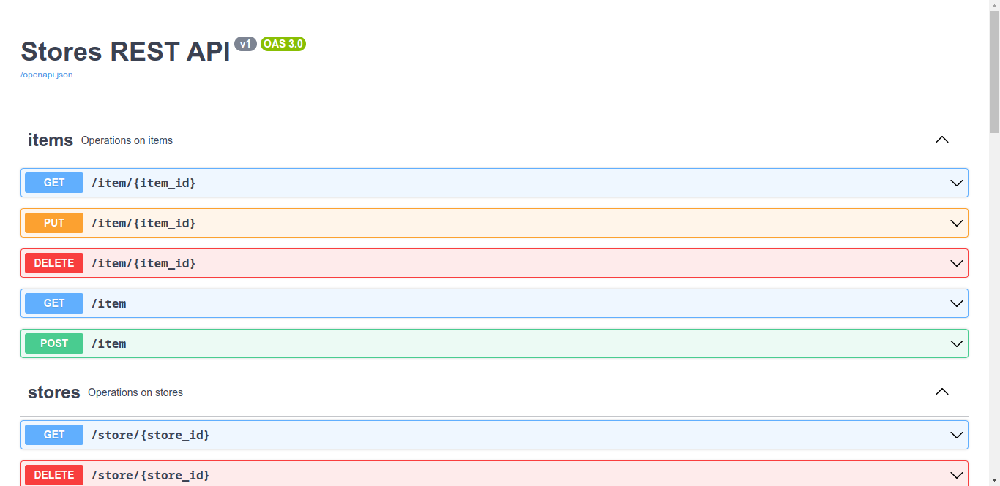

# rest-api-flask-stores

This is a REST API for the management of a store, in it you can add a product and each product can have a category, this relationship is done through table models that are stored in a database.

## Preview image

## A little context

The development of this REST API helped me to better understand the concepts that are required for the design and creation of it. I learned many new things, that from now on I will use professionally in my next projects. The link I left is where I learned how to develop this type of REST APIs.

This REST API developed with Flask, Python, Flask-Sqlalchemy, Flask-Migrate, Flask-JWT-Extended and Flask-Smorest. Flask-Smorest helped me to implement a graphical interface using Swagger UI.
